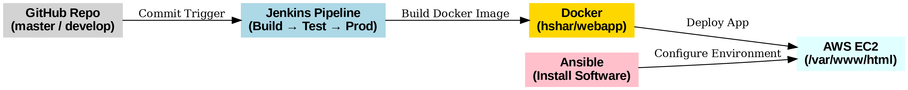

# 🚀 DevOps Lifecycle Automation – Abode Software

## 📌 Project Overview
This project simulates working as a **Sr. DevOps Engineer at Adobe Software**, where the task was to implement a complete **DevOps lifecycle** for their product [hshar/website](https://github.com/hshar/website).  
The solution includes **Git branching, Jenkins pipeline automation, Docker containerization, and AWS CodeBuild integration**.  

---

## 🛠️ Tools & Technologies
- **Version Control:** Git, GitHub  
- **CI/CD:** Jenkins
- **Containerization:** Docker  
- **Cloud Services:** AWS EC2, VPC  
- **Configuration Management:** Ansible (for environment setup)  

---

## ⚙️ Architecture
   

---

## 🚀 Implementation Steps
1. **Configuration Management**
   - Installed necessary software on servers using **Ansible**.  
   - Ensured all worker nodes had required tools (Jenkins, Java, Docker).  

2. **Git Workflow**
   - Configured **branching strategy**:  
     - `master` branch → Build → Test → Deploy to **Production**  
     - `develop` branch → Build → Test only (no deployment)  

3. **CodeBuild Integration**
   - Configured **jenkins** to trigger automatically on commits.  
   - Ensured builds run for both `master` and `develop` branches.  

4. **Dockerization**
   - Used base image `hshar/webapp` and created a **custom Dockerfile**.  
   - Built Docker images on every GitHub push.  
   - Deployed the app under `/var/www/html`.

5. **Jenkins Pipeline**
   - Created a **multi-stage Jenkinsfile** with jobs:  
     - **Job1 – Build**: Build the application.  
     - **Job2 – Test**: Run application tests.  
     - **Job3 – Prod**: Deploy containerized code to production.  

---

## ✅ Outcomes
- Implemented a **branch-based CI/CD strategy** with Jenkins.  
- Automated **build, test, and production deployment** pipelines.  
- Containerized the application with **Docker** for consistency.  
- Ensured **faster and reliable releases** using Git workflow automation.
